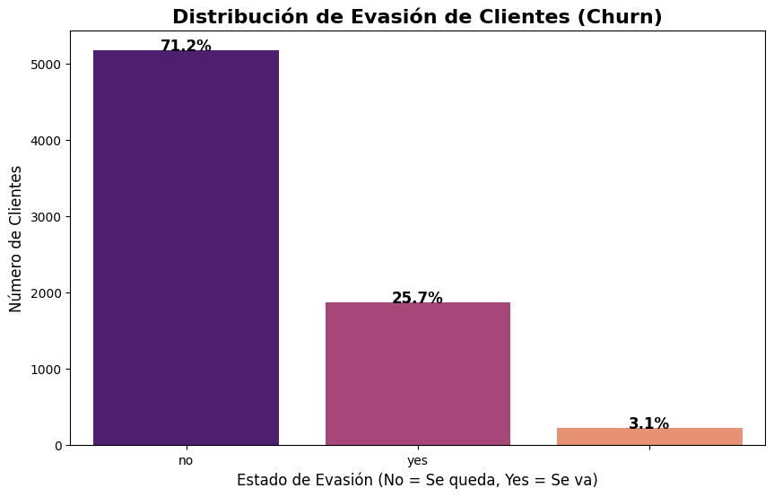
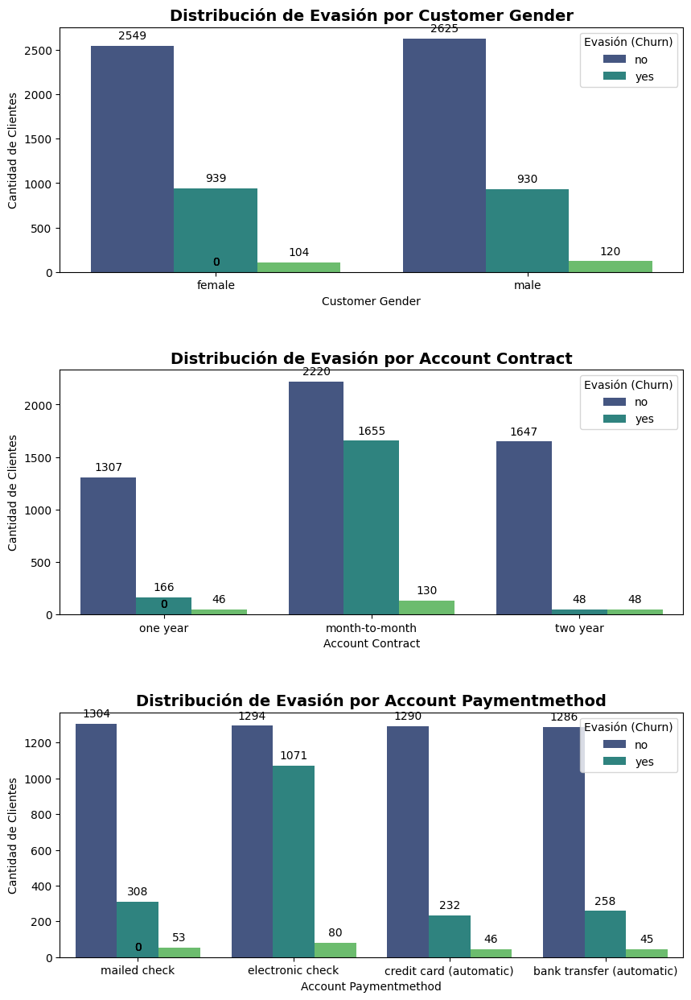
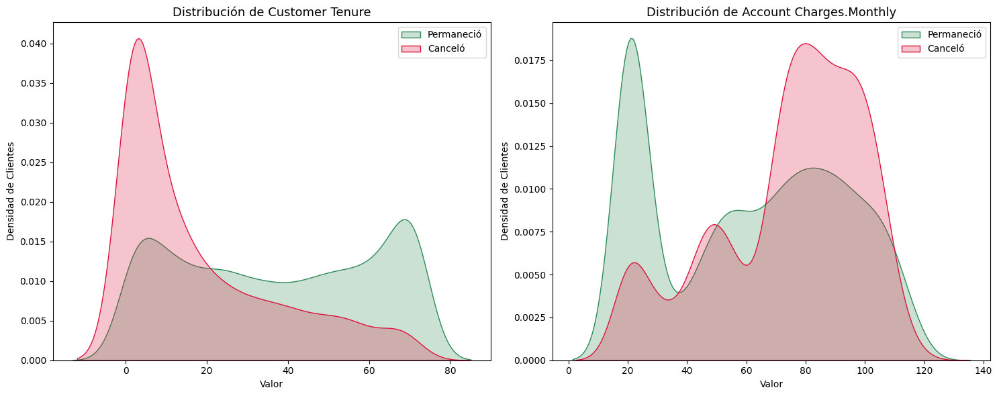

# 📞 Challenge TelecomX - Análisis de Deserción (Churn)

### **📖 Descripción**
**Telecom X Latam** enfrenta una tasa de deserción significativa. Este proyecto, desarrollado en el marco del **Challenge de Data Science de Alura**, aborda el problema mediante un flujo de ingeniería de datos y un análisis exploratorio exhaustivo sobre una base de **7,032 clientes**.

---

## 🎯 Objetivos Estratégicos
* **Detectar causas:** Identificar los factores clave que impulsan la deserción.
* **Cuantificar impacto:** Medir el peso de cada variable en la tasa de abandono.
* **Proponer soluciones:** Definir recomendaciones estratégicas fundamentadas en datos.

---

## 📊 Principales Hallazgos (Insights)

### **📈 Métrica Global**
* **Tasa de Deserción:** **25.7%** de la base total de clientes muestra una clara intención de abandono.

### **⏰ El Factor Tiempo (Momento Crítico)**
* **Punto de Quiebre:** La densidad de abandono es máxima en los **primeros meses** de contrato. Superar el primer semestre incrementa drásticamente la lealtad.

### 👤 Perfil de Alto Riesgo
| Factor de Riesgo | Tasa de Deserción / Impacto |
| :--- | :--- |
| **Contrato Mensual** | **42.7%** de deserción |
| **Uso de Fibra Óptica** | **41.9%** de deserción |
| **Adultos Mayores** | **41.7%** de deserción |
| **Pago con Cheque Electrónico** | **45.3%** de deserción |
| **Sin Soporte Técnico** | Riesgo **2.7 veces mayor** |

### 💰 Impacto Financiero
* **Clientes Premium en Riesgo:** La fuga afecta desproporcionadamente a clientes con cargos mensuales elevados.
* **Comparativa de Cargos:** La mediana de pago de los desertores es de **$80**, mientras que la de los clientes leales es de **$63**.
* **Riesgo de Ingresos:** El abandono temprano de clientes con facturas altas representa la mayor amenaza financiera.
---

## 📋 Descripción de Archivos Principales

### **📄 TelecomX_LATAM.ipynb**

**Análisis de Extremo a Extremo:** Es el núcleo técnico del proyecto. Incluye todo el flujo de trabajo: desde la carga y desanidación de archivos JSON complejos, hasta la limpieza profunda de datos y la generación de los hallazgos estratégicos de negocio.

### **📂 data/**

**Gestión de Datos:** Carpeta que aloja el dataset original de la compañía. Se documenta un proceso de transformación donde se inicia con **7,267 registros** y, tras la limpieza de valores nulos y normalización, se obtienen **7,032 registros limpios**.

### **📂 Gráficos/**

**Evidencia Visual:** Repositorio de las gráficas generadas (Seaborn y Matplotlib). Estas visualizaciones sirven como soporte para validar los puntos críticos de deserción.

### **📄 requirements.txt**

**Reproducibilidad Técnica:** Archivo que especifica las librerías necesarias para ejecutar el proyecto con las versiones exactas.

---

## 🖼️ Ejemplos de Visualización

### **1. Distribución Global de Evasión**
**Estado actual:** Visualización de la proporción de clientes que permanecen vs. los que se van.

---

### **2. Análisis de Contratos y Pagos**
**Segmentos críticos:** Se evidencia que el contrato mensual es el principal motor de fuga.

---

### **3. Permanencia y Cargos Mensuales**
**Impacto económico:** Gráficos de densidad que muestran el riesgo en clientes nuevos y de alta facturación.

---

## 📌 Conclusión Clave

> **La deserción no es aleatoria:** Responde a patrones claros de experiencia temprana y tipo de contrato. Resolver el problema requiere un enfoque preventivo en los primeros 6 meses de vida del cliente.

---

## 🚀 Cómo ejecutar el proyecto

### **📍 Opción 1: Google Colab (Recomendado — No requiere instalación)**

Haz clic en el siguiente botón para abrir el proyecto directamente en la nube:

1. **Ejecución:** Ve al menú superior y selecciona **Entorno de ejecución > Ejecutar todo** (Runtime > Run all).

2. **Resultados:** El notebook procesará el dataset JSON, hará el ETL y generará las visualizaciones automáticamente.

---

### **📦 Dependencias principales**

Para asegurar la reproducibilidad del análisis, se requieren las siguientes librerías:

| Librería | Versión | Función |

| :--- | :--- | :--- |

| **Pandas** | `2.0.3` | Manipulación y limpieza de datos (ETL) |

| **NumPy** | `1.24.3` | Operaciones numéricas y vectores |

| **Matplotlib** | `3.7.2` | Generación de gráficos base |

| **Seaborn** | `0.12.2` | Visualizaciones estadísticas avanzadas |

| **SciPy** | `1.11.0` | Pruebas de correlación y estadística |

| **Requests** | `2.31.0` | Consumo de datos desde fuentes externas |

## 📚 Agradecimientos

🎓 **Alura Latam** y **Oracle**: Por los retos técnicos y la formación integral a través del programa **ONE (Oracle Next Education)**, que impulsan el crecimiento profesional en tecnología.
* 🐍 **Comunidad de Data Science**: Por las herramientas de código abierto y la documentación que hicieron posible la ejecución de este análisis.

---

## ✍️ Créditos y Autoría

Este proyecto fue desarrollado como parte del **Challenge Data Science** de **Alura Latam**.

**Desarrollado por:**
### ✨ **Idabel Coparropa**
*Data Scientist Enthusiast | Business Analyst*

---

  <b>TelecomX Churn Analysis</b> • 2026 
  Hecho con ❤️ y Python por Idabel Coparropa

  
